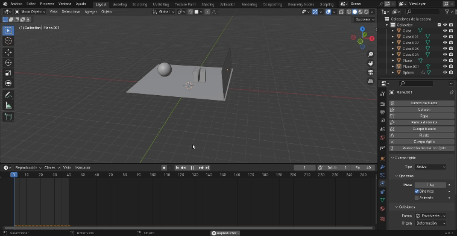
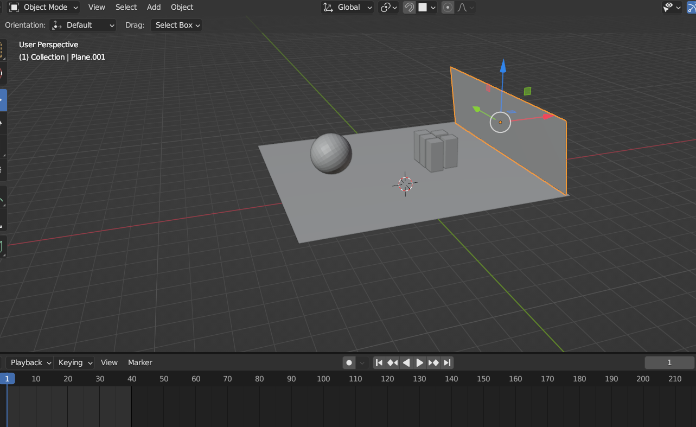
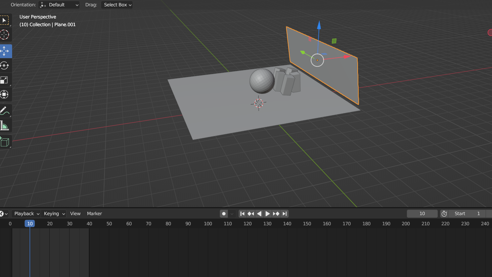
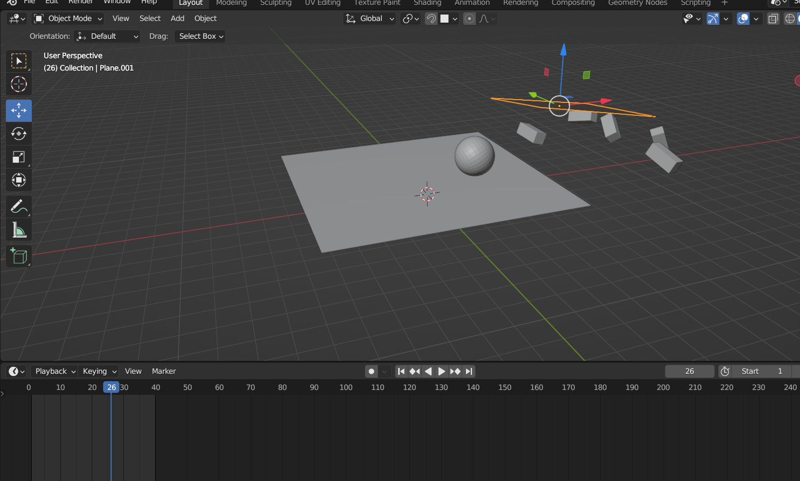

# SimulacionPorComputadora-LlamasJose
##Trabajos de la materia de simulacion por computadora
## **Practica04-Simulacion-colision**
Gif de simulación:

La vista de inicio:

Simulacion ya avanzada:

Simulacion ya casi por terminar:

