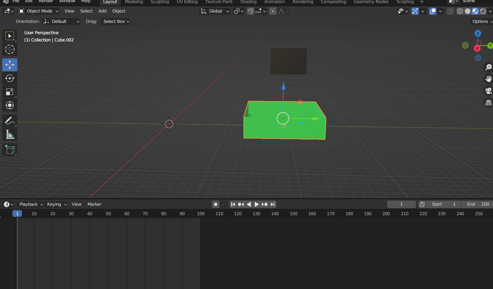

# SimulacionPorComputadora-LlamasJose
##Trabajos de la materia de simulacion por computadora
## **Practica05-Simulacion-liquidos**
La vista de inicio:

Simulacion ya avanzada:

Simulacion ya casi por terminar:

