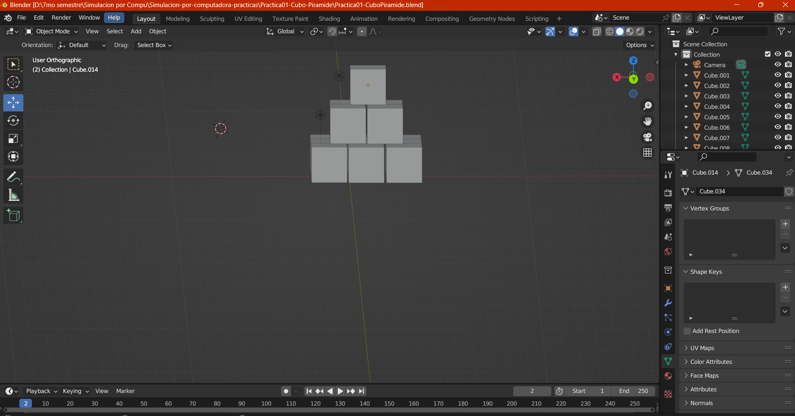
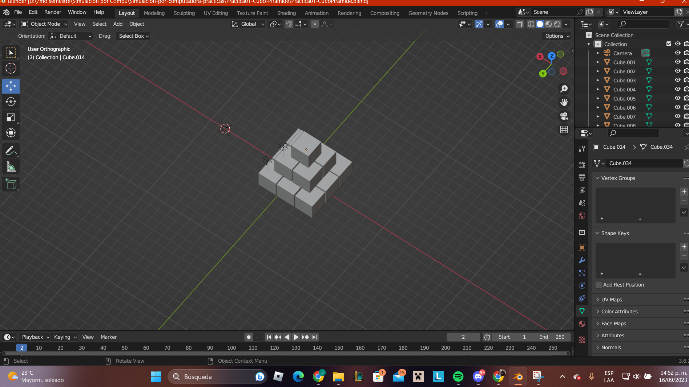
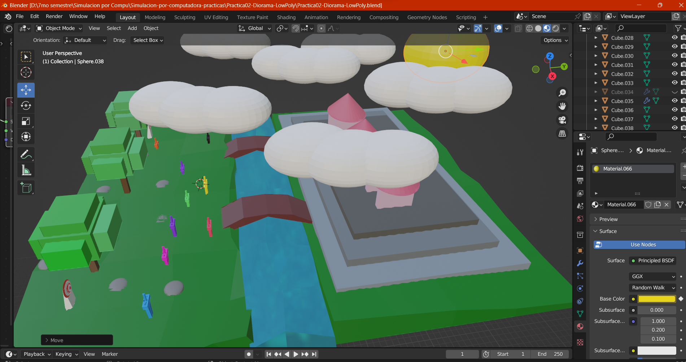
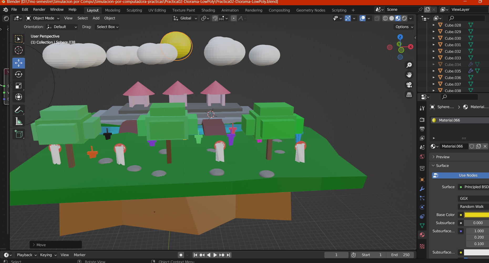
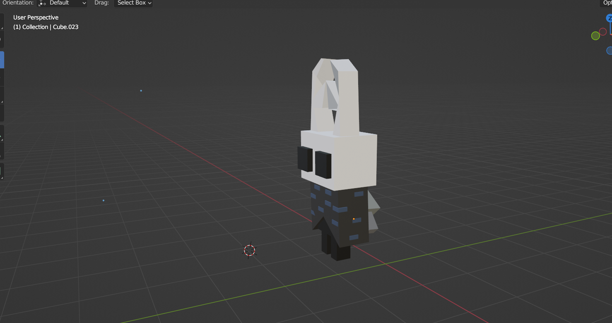
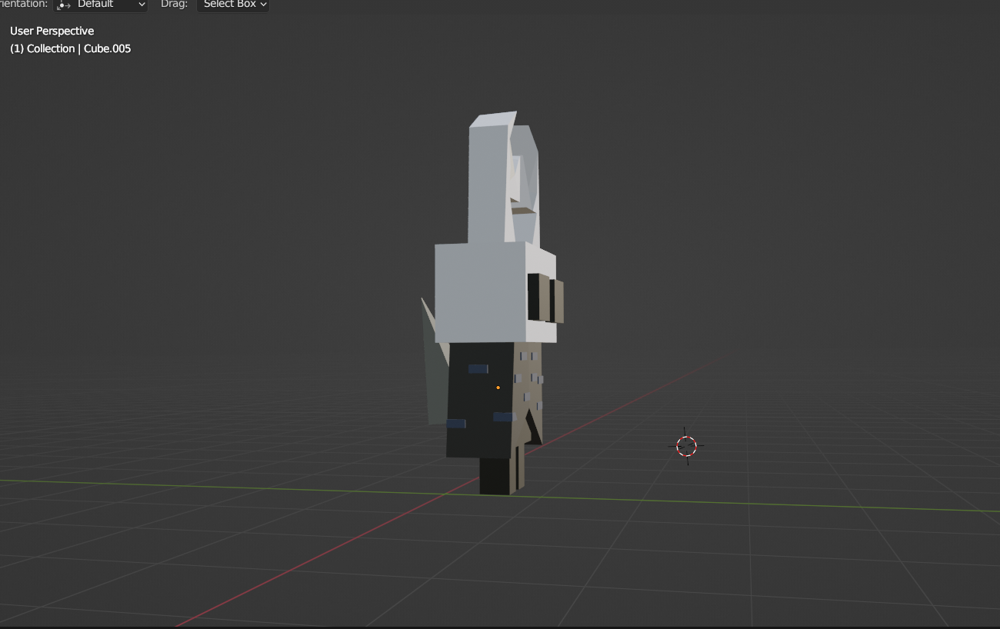
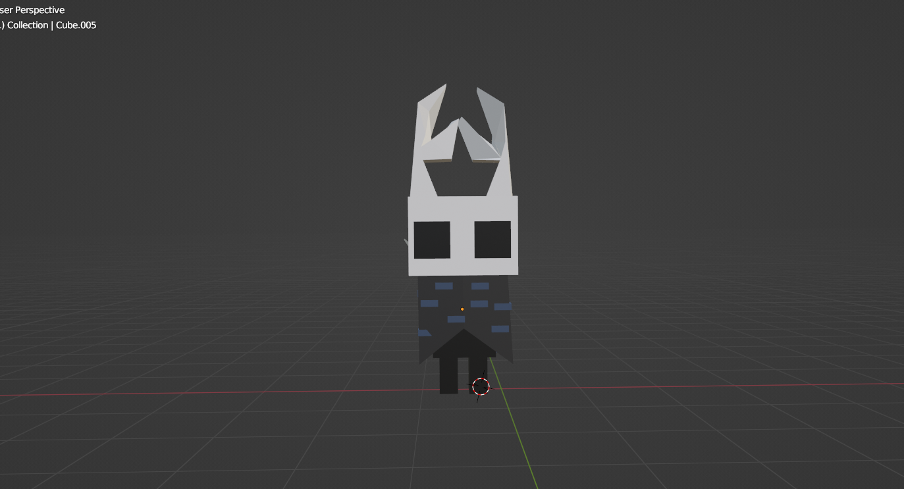
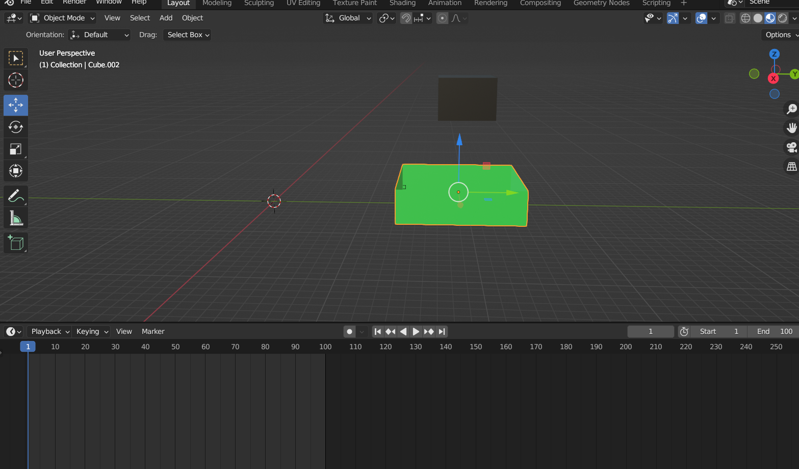
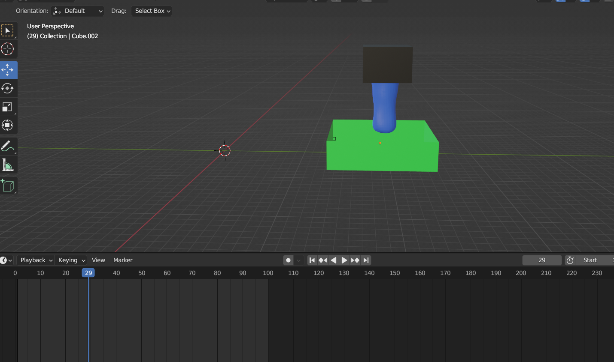
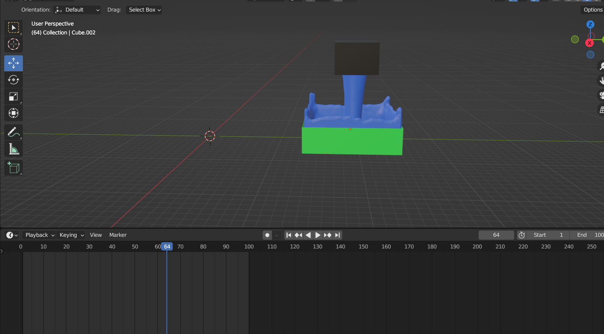

# SimulacionPorComputadora-LlamasJose
##Trabajos de la materia de simulacion por computadora
## **Practica01-Cubo-Piramide**
La vista de lado:

La vista desde una perspectiva inclinada:

## **Practica02-Diorama-LowPoly**
La vista completa:

La vista desde una perspectiva trasera:

## **Practica03-Creacion-personaje**
La vista de lado:

La vista desde el otro lado:

La vista desde el frente:

## **Practica04-Simulacion-colision**
La vista de inicio:

Simulacion ya avanzada:

Simulacion ya casi por terminar:

## **Practica05-Simulacion-liquidos**
La vista de inicio:

Simulacion ya avanzada:

Simulacion ya casi por terminar:

